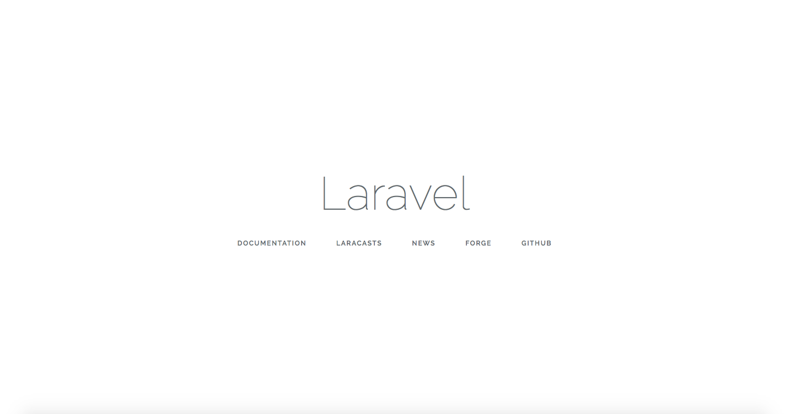

# How to deploy Laravel 

Apparently you already have a **Laravel application** and a **server** or **shared hosting**. 
Now you need to automate the process of **deployment**. 
Deployer will help you with this, as it ships with some ready to use recipes for **Laravel** based applications. 

Let's start with [installation](installation.md) of Deployer. Run the following commands in terminal: 

```sh
curl -LO https://deployer.org/deployer.phar
mv deployer.phar /usr/local/bin/dep
chmod +x /usr/local/bin/dep
```

Next, in your projects directory run:

```sh
dep init -t Laravel
```

This command will create a `deploy.php` file for *deploying Laravel*. This file is called a *recipe* and is based on the built-in recipe *laravel.php*.
It contains some host configurations and an example task. 

First, we need to configure the `repository` config of our application:

```php
set('repository', 'git@github.com:user/project.git');
```

Second, configure host:
 
```php
host('domain.org')
    ->set('deploy_path', '/var/www/html');
```

Make sure that `~/.ssh/config` contains `domain.org`, and that you can connect to the host through ssh.

Another important parameter is your project's `deploy_path`; where your project will be located on the remote host. 

Let's do our first deploy:

```sh
dep deploy
```

If everything goes well, deployer will create the following structure on the remote host in `deploy_path`:

```text
├── .dep
├── current -> releases/1
├── releases
│   └── 1
└── shared
    ├── .env
    └── storage
```

* `releases` dir contains *deploy* releases of the *Laravel* application,
* `shared` dir contains `.env` config and `storage` which will be symlinked to each release,
* `current` is symlinked to last release,
* `.dep` dir contains special metadata for deployer (releases log, `deploy.log` file, etc).

Configure your web server to serve files from the `current` symlink. For example if you are using nginx:

```config
server {
  listen 80;
  server_name domain.org;

  root /var/www/html/current/public;

  location / {
    try_files $uri /index.php$is_args$args;
  }
}
```

Now you will be able to serve your **laravel project**!



If you want to automatically migrate your database, the *Laravel* recipe ships with an `artisan:migrate` task. Add these lines to your `deploy.php`:

```php
after('deploy:update_code', 'artisan:migrate');
```

See more about configuration and task declarations in our [documentation](getting-started.md).

...
